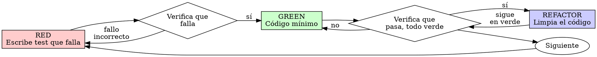

# Test driven development (TDD)

## Visión general

Escribe el test primero. Obsérvalo fallar. Escribe el código mínimo para que pase.

**Principio clave:** si no has visto fallar el test, no sabes si comprueba lo correcto.

**Violar la letra de las reglas es violar su espíritu.**

## Cuándo usarlo

**Siempre:**

- Funcionalidades nuevas
- Corrección de bugs
- Refactors
- Cambios de comportamiento

**Excepciones (consúltalo con tu compañero humano):**

- Prototipos desechables
- Código generado
- Ficheros de configuración

¿Estás pensando "me salto el TDD solo esta vez"? Para. Eso es una excusa.

## La ley de hierro

```
NADA DE CÓDIGO DE PRODUCCIÓN SIN UN TEST QUE FALLE ANTES
```

¿Has escrito código antes que el test? Bórralo. Empieza de nuevo.

**Sin excepciones:**

- No lo guardes "de referencia"
- No lo "adaptes" mientras escribes los tests
- No lo mires
- Borrar significa borrar

Implementa desde cero a partir de los tests. Punto.

## Red-Green-Refactor



### RED - Escribe el test que falla

Escribe un único test mínimo que muestre qué debería pasar.

<Good>
```typescript
test('reintenta operaciones fallidas 3 veces', async () => {
  let attempts = 0;
  const operation = () => {
    attempts++;
    if (attempts < 3) throw new Error('fallo');
    return 'éxito';
  };

const result = await retryOperation(operation);

expect(result).toBe('éxito');
expect(attempts).toBe(3);
});

````
Nombre claro, comprueba comportamiento real, una sola cosa
</Good>

<Bad>
```typescript
test('el reintento funciona', async () => {
  const mock = jest.fn()
    .mockRejectedValueOnce(new Error())
    .mockRejectedValueOnce(new Error())
    .mockResolvedValueOnce('éxito');
  await retryOperation(mock);
  expect(mock).toHaveBeenCalledTimes(3);
});
````

Nombre vago, comprueba el mock, no el código
</Bad>

**Requisitos:**

- Un solo comportamiento
- Nombre claro
- Código real (sin mocks salvo que sea inevitable)

### Verifica RED - Obsérvalo fallar

**OBLIGATORIO. Nunca te lo saltes.**

```bash
pnpm test path/to/test.test.ts
```

Confirma:

- El test falla (no da error)
- El mensaje de fallo es el esperado
- Falla porque falta la funcionalidad (no por un typo)

**¿El test pasa?** Estás comprobando un comportamiento que ya existe. Corrige el test.

**¿El test da error?** Arregla el error y vuelve a ejecutarlo hasta que falle correctamente.

### GREEN - Código mínimo

Escribe el código más simple que haga pasar el test.

<Good>
```typescript
async function retryOperation<T>(fn: () => Promise<T>): Promise<T> {
  for (let i = 0; i < 3; i++) {
    try {
      return await fn();
    } catch (e) {
      if (i === 2) throw e;
    }
  }
  throw new Error('inalcanzable');
}
```
Justo lo necesario para pasar
</Good>

<Bad>
```typescript
async function retryOperation<T>(
  fn: () => Promise<T>,
  options?: {
    maxRetries?: number;
    backoff?: 'linear' | 'exponential';
    onRetry?: (attempt: number) => void;
  }
): Promise<T> {
  // YAGNI
}
```
Sobre-ingenierizado
</Bad>

No añadas funcionalidades, no refactorices otro código, ni "mejores" más allá del test.

### Verifica GREEN - Obsérvalo pasar

**OBLIGATORIO.**

```bash
pnpm test path/to/test.test.ts
```

Confirma:

- El test pasa
- El resto de tests siguen pasando
- Salida limpia (sin errores ni warnings)

**¿El test falla?** Arregla el código, no el test.

**¿Fallan otros tests?** Arréglalo ahora.

### REFACTOR - Limpieza

Solo después de estar en verde:

- Elimina duplicación
- Mejora los nombres
- Extrae helpers

Mantén los tests en verde. No añadas comportamiento.

### Repite

El siguiente test que falle, para la siguiente funcionalidad.

## Buenos tests

| Cualidad              | Bien                                               | Mal                                         |
| --------------------- | -------------------------------------------------- | ------------------------------------------- |
| **Mínimo**            | Una sola cosa. ¿Hay un "y" en el nombre? Divídelo. | `test('valida email y dominio y espacios')` |
| **Claro**             | El nombre describe el comportamiento               | `test('prueba1')`                           |
| **Muestra intención** | Demuestra la API deseada                           | Oculta qué debería hacer el código          |

Al escribir o modificar cualquier test, lee [escribir-buenos-test.md](references/escribir-buenos-test.md) para las reglas que mantienen los tests honestos:

- Nombra el cambio de producción que haría fallar el test — antes de escribirlo
- Comprueba (assert) sobre comportamiento real, nunca sobre el comportamiento de un mock
- Mantén el código exclusivo de tests en utilidades de test, fuera de las clases de producción
- Entiende los efectos secundarios de una dependencia antes de mockearla

## Racionalizaciones habituales

| Excusa                                                    | Realidad                                                                                                                                                                                                                                                                                                                          |
| --------------------------------------------------------- | --------------------------------------------------------------------------------------------------------------------------------------------------------------------------------------------------------------------------------------------------------------------------------------------------------------------------------- |
| "Demasiado simple para testear"                           | El código simple también se rompe. El test tarda 30 segundos.                                                                                                                                                                                                                                                                     |
| "Lo testeo después"                                       | Los tests escritos después pasan a la primera — lo cual no demuestra nada. Pueden testear lo que no toca, testear la implementación en vez del comportamiento, o pasar por alto el caso límite que olvidaste. Nunca los viste fallar, así que nunca demostraste que detectan el bug. Escribir el test primero obliga a ese fallo. |
| "Los tests después logran lo mismo (espíritu, no ritual)" | Los tests después responden a "¿qué hace esto?"; los tests antes responden a "¿qué debería hacer?". Los tests escritos después están sesgados por el código que ya escribiste — verificas los casos que recordabas, no los que habrías descubierto. Cobertura sin prueba de que los tests funcionan.                              |
| "Ya lo probé a mano"                                      | Probar a mano es improvisado: no queda constancia de qué cubriste, no se puede volver a ejecutar cuando cambia el código, y es fácil olvidar casos bajo presión. "Me funcionó cuando lo probé" ≠ exhaustivo. Los tests automatizados se ejecutan igual siempre.                                                                   |
| "Borrar X horas de trabajo es un desperdicio"             | Falacia del coste hundido — ese tiempo ya está gastado de todos modos. La decisión real es: reescribir con TDD (alta confianza) frente a quedártelo y añadir tests después (poca confianza, bugs probables). El verdadero desperdicio es quedarte con código en el que no puedes confiar.                                         |
| "Lo guardo de referencia y escribo los tests antes"       | Acabarás adaptándolo. Eso es testear después. Borrar significa borrar.                                                                                                                                                                                                                                                            |
| "Necesito explorar primero"                               | Vale. Tira la exploración y empieza con TDD.                                                                                                                                                                                                                                                                                      |
| "El test es difícil porque el diseño aún no está claro"   | Escucha al test. Difícil de testear = difícil de usar.                                                                                                                                                                                                                                                                            |
| "El TDD me va a ralentizar"                               | El TDD ES el camino pragmático: detecta bugs antes del commit, evita regresiones y te deja refactorizar sin miedo. Los atajos "pragmáticos" acaban en depurar en producción — más lento, no más rápido.                                                                                                                           |
| "Probar a mano es más rápido"                             | Probar a mano no cubre los casos límite. Tendrás que volver a probar en cada cambio.                                                                                                                                                                                                                                              |
| "El código existente no tiene tests"                      | Lo estás mejorando. Añade tests también para el código existente.                                                                                                                                                                                                                                                                 |

## Señales de alarma - PARA y empieza de nuevo

- Código antes que el test
- Test después de la implementación
- El test pasa a la primera
- No puedes explicar por qué falló el test
- Tests añadidos "más tarde"
- Racionalizar "solo esta vez"
- "Ya lo probé a mano"
- "Los tests después logran lo mismo"
- "Es cuestión de espíritu, no de ritual"
- "Lo guardo de referencia" o "adapto el código existente"
- "Ya he invertido X horas, borrar sería un desperdicio"
- "El TDD es dogmático, yo soy pragmático"
- "Esto es distinto porque..."

**Todo esto significa: borra el código. Empieza de nuevo con TDD.**

## Ejemplo: corrección de un bug

**Bug:** se acepta un email vacío

**RED**

```typescript
test("rechaza el email vacío", async () => {
  const result = await submitForm({ email: "" });
  expect(result.error).toBe("Email requerido");
});
```

**Verifica RED**

```bash
$ pnpm test
FAIL: se esperaba 'Email requerido', se obtuvo undefined
```

**GREEN**

```typescript
function submitForm(data: FormData) {
  if (!data.email?.trim()) {
    return { error: "Email requerido" };
  }
  // ...
}
```

**Verifica GREEN**

```bash
$ pnpm test
PASS
```

**REFACTOR**
Extrae la validación para varios campos si hace falta.

## Checklist de verificación

Antes de dar el trabajo por terminado:

- [ ] Cada función/método nuevo tiene un test
- [ ] Has visto fallar cada test antes de implementar
- [ ] Cada test falló por el motivo esperado (falta la funcionalidad, no por un typo)
- [ ] Escribiste el código mínimo para pasar cada test
- [ ] Todos los tests pasan
- [ ] Salida limpia (sin errores ni warnings)
- [ ] Los tests usan código real (mocks solo si es inevitable)
- [ ] Casos límite y errores cubiertos

¿No puedes marcar todas las casillas? Te has saltado el TDD. Empieza de nuevo.

## Si te atascas

| Problema                        | Solución                                                                                         |
| ------------------------------- | ------------------------------------------------------------------------------------------------ |
| No sé cómo testear esto         | Escribe la API que te gustaría tener. Escribe primero el assert. Pregunta a tu compañero humano. |
| El test es demasiado complicado | El diseño es demasiado complicado. Simplifica la interfaz.                                       |
| Tengo que mockear todo          | El código está demasiado acoplado. Usa inyección de dependencias.                                |
| El setup del test es enorme     | Extrae helpers. ¿Sigue siendo complejo? Simplifica el diseño.                                    |

## Integración con depuración

¿Encontraste un bug? Escribe un test que falle reproduciéndolo. Sigue el ciclo de TDD. El test demuestra el arreglo y evita regresiones.

Nunca arregles un bug sin un test.

## Regla final

```
Código de producción → existe un test y falló primero
Si no → no es TDD
```

Sin excepciones sin el permiso de tu compañero humano.
